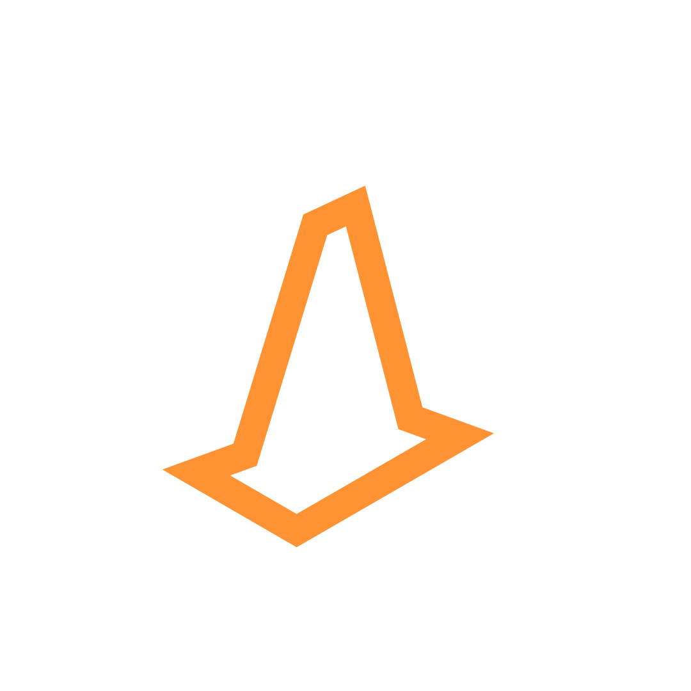

  

# 🚗 Sistema para Autoescola — Projeto de TCC 💻

Trabalho final do curso Técnico em Informática para Internet — IFES Campus Colatina  
**Alunos**: André Luiz Mendes Siqueira, Anna Raquel Sandrini, Ellen Marquete Biazatti e Valentina Roldi

---

---

## 📌 Sumário

- [💡 Ideia do Projeto](#-ideia-do-projeto)
- [📌 Contexto Real](#-contexto-real)
- [🧰 Tecnologias Utilizadas](#-tecnologias-utilizadas)
- [🧠 Experiência de Desenvolvimento](#-experiência-de-desenvolvimento)
- [📂 Documentação (Notion)](#-documentação-notion)
- [🚀 Próximos Passos](#-próximos-passos)
- [🤝 Agradecimento](#-agradecimento)
- [🌍 English Version](#-english-version)

---

## 💡 Ideia do Projeto

Desenvolver um **sistema web para autoescola** que agilize processos administrativos como:

- Marcações e desmarcações de aulas
- Gestão de avisos e informações sobre a autoescola.
- Gestão de alunos, veículos, aulas e instrutores

---

## 📌 Contexto Real

A ideia surgiu a partir da **experiência pessoal** de alguns integrantes do grupo como alunos em uma autoescola. Ao observar o funcionamento administrativo da empresa, identificamos **problemas que poderiam ser resolvidos com um sistema digital**.

Apresentamos a proposta ao proprietário da autoescola, que demonstrou interesse e **nos autorizou a realizar um levantamento de requisitos diretamente com os funcionários**. Assim, mergulhamos no dia a dia da empresa para entender o que precisava ser automatizado ou melhorado.

> O sistema foi projetado e desenvolvido em menos de um ano, e ainda passa por melhorias.

---

## 🧰 Tecnologias Utilizadas

### 🔤 Linguagens:
- **PHP**: Regras de negócio e conexão com o banco de dados
- **HTML**: Estruturação das páginas
- **CSS**: Estilização dos elementos visuais
- **JavaScript**: Funcionalidades interativas
- **SQL**: Criação e manipulação de dados

### ⚙️ Ferramentas e Plataformas:
- **VSCode**: Editor de código
- **Git & GitHub**: Controle de versão local e remoto
- **MySQL**: Banco de dados relacional
- **XAMPP**: Ambiente de servidor local
- **AWS**: Armazenamento em nuvem do banco de dados
- **Bootstrap**: Framework para estilização e responsividade

---

## 🧠 Experiência de Desenvolvimento

A construção do sistema nos permitiu:

- Aplicar **conhecimentos adquiridos ao longo do curso**
- Aprender novas ferramentas e técnicas de desenvolvimento
- Trabalhar em equipe, dividindo responsabilidades de forma eficiente
- Entender como funciona um **projeto real, com cliente e demandas práticas**

Mesmo com limitações técnicas e de tempo, conseguimos entregar um sistema funcional e com **grande potencial de evolução**.

---

## 📂 Documentação (Notion)

Acesse nossa documentação completa com fluxos, requisitos, prints e outros detalhes:

👉 [Notion — Projeto TCC](https://www.notion.so/n-andre/PROJETO-TCC-1589eadf89af4310b4e836a607c3e728?pvs=4)

---

## 🚀 Próximos Passos

Sugerimos que as próximas versões do projeto incluam:

- Dashboard para relatórios
- Integração com APIs de pagamento
- Área do aluno com login individual
- Aplicativo mobile para facilitar o acesso

---

## 🤝 Agradecimento

Agradecemos à autoescola parceira pela abertura e colaboração no projeto. Este trabalho não só marcou nossa conclusão do curso, como também **nos aproximou da realidade do mercado**.

---

## 🌍 English Version

  

# 🚗 Driving School System — Final Project 💻

Final project of the Technical Course in Internet Informatics — IFES Campus Colatina  
**Students**: André Luiz Mendes Siqueira, Anna Raquel Sandrini, Ellen Marquete Biazatti and Valentina Roldi

---

## 💡 Project Idea

Develop a **web system for driving schools** to streamline administrative processes such as:

- Scheduling and rescheduling classes
- Recording payments
- Managing students, vehicles, instructors, and classes

---

## 📌 Real Context

The idea came from the **personal experience** of some team members who were students at a driving school. Observing the administrative routine, we identified **problems that could be solved with a digital system**.

We presented the idea to the owner of the driving school, who showed interest and **allowed us to conduct a requirement analysis on site**. We got involved in the day-to-day activities of the company to identify what could be improved or automated.

> The system was designed and developed in less than a year and is still being improved.

---

## 🧰 Technologies Used

### 🔤 Languages:
- **PHP**: Business logic and database connection
- **HTML**: Page structure
- **CSS**: Styling
- **JavaScript**: Interactive functionalities
- **SQL**: Data creation and manipulation

### ⚙️ Tools and Platforms:
- **VSCode**: Code editor
- **Git & GitHub**: Version control (local and remote)
- **MySQL**: Relational database
- **XAMPP**: Local server environment
- **AWS**: Cloud-hosted database
- **Bootstrap**: UI framework for styling and responsiveness

---

## 🧠 Development Experience

Building this system allowed us to:

- Apply knowledge acquired throughout the course
- Learn new tools and technologies
- Work collaboratively and efficiently
- Understand how to execute a **real-world client-oriented project**

Despite time and knowledge limitations, we delivered a functional system with **great potential for future improvements**.

---

## 📂 Documentation (Notion)

Full project documentation with flows, requirements, screenshots and more:

👉 [Notion — Final Project](https://www.notion.so/n-andre/PROJETO-TCC-1589eadf89af4310b4e836a607c3e728?pvs=4)

---

## 🚀 Next Steps

Suggestions for future versions:

- Dashboard for reports
- Payment API integration
- Student login area
- Mobile app for accessibility

---

## 🤝 Acknowledgment

We thank the driving school that partnered with us for their openness and support. This project marked the end of our technical course and brought us **closer to real market demands**.
